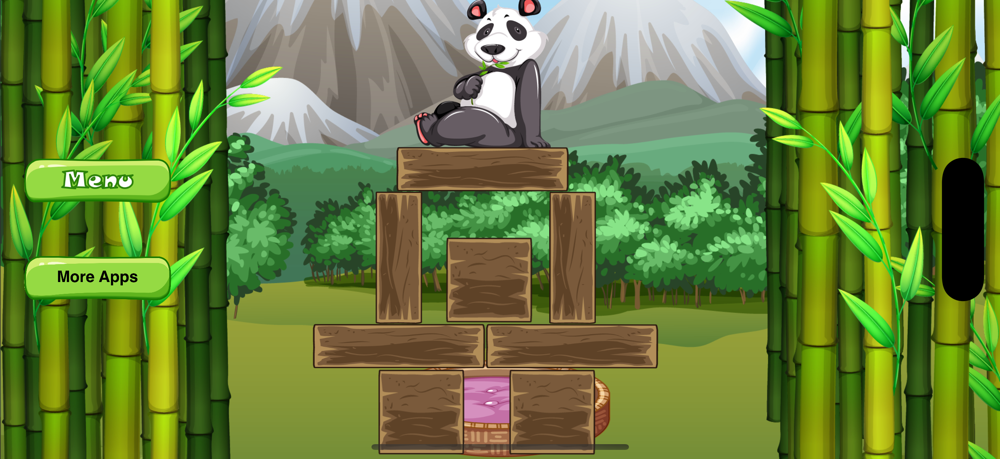
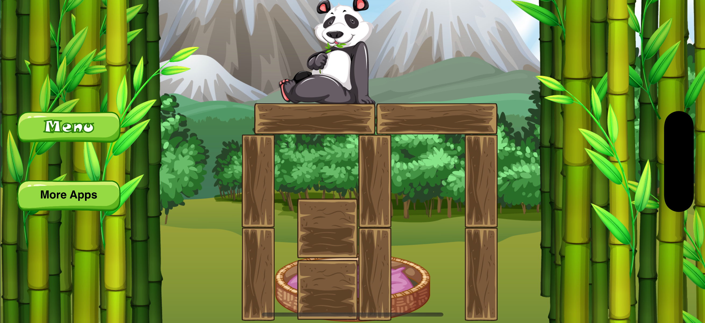
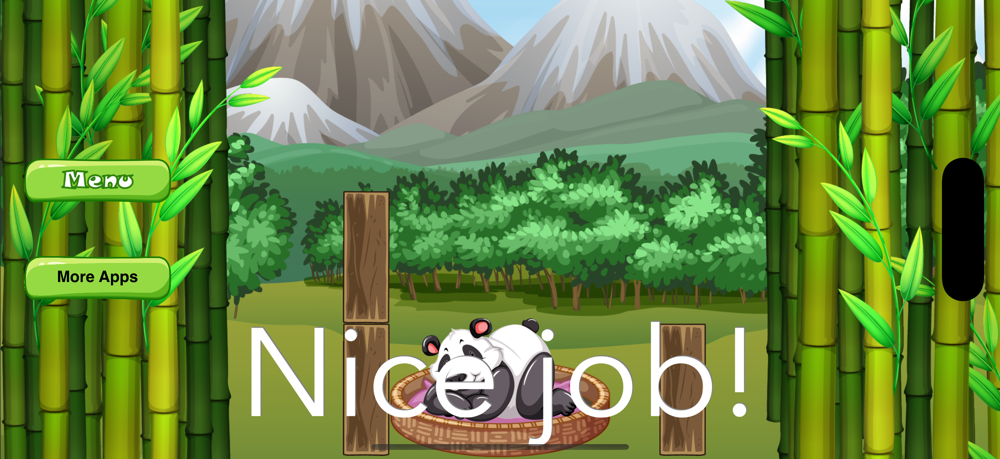

# 🐼 Panda Nap

A delightful iOS puzzle game where you help a sleepy panda reach her bed by removing obstacles. Be careful not to wake her up!

[](https://developer.apple.com/ios/)
[](https://swift.org/)
[](https://developer.apple.com/spritekit/)
[](https://apps.apple.com/us/app/panda-nap-panda-games/id1519636895)

## 📱 Download

**Available on the App Store**: [Download Panda Nap](https://apps.apple.com/us/app/panda-nap-panda-games/id1519636895)

## 🖼️ Screenshots

<div align="center">
  
  
  
</div>

## 🎮 Game Description

The panda is taking a nap, don't wake her up! In this physics-based puzzle game, you need to strategically remove obstacles so that the panda can fall smoothly onto her bed. The challenge is to ensure the panda doesn't fall to the ground, as that would wake her up and end the level.

### Key Features
- **10 Challenging Levels**: Each level presents unique obstacle configurations
- **Physics-Based Gameplay**: Realistic physics simulation using SpriteKit
- **Intuitive Touch Controls**: Simple tap-to-remove obstacle mechanics
- **Progressive Difficulty**: Levels become more challenging as you advance
- **Beautiful Artwork**: Charming panda character and relaxing visual design
- **Sound Effects**: Immersive audio with background music and sound effects
- **Multi-language Support**: Available in English and Chinese (Simplified & Traditional)

## 🎯 How to Play

1. **Objective**: Help the panda reach her bed safely
2. **Controls**: Tap on obstacles to remove them
3. **Challenge**: The panda must not fall to the ground (she'll wake up!)
4. **Success**: Guide the panda to land gently on the bed
5. **Progression**: Complete each level to unlock the next one

## 🛠 Technical Details

### Built With
- **SpriteKit**: Apple's 2D game framework for physics and rendering
- **Swift**: Modern iOS development language
- **CocoaPods**: Dependency management
- **Google Mobile Ads**: Monetization through banner and interstitial ads

### Dependencies
- `Localize-Swift`: Internationalization support
- `SwiftyButton`: Custom button implementations
- `SnapKit`: Auto Layout DSL
- `Then`: Object initialization utilities
- `Google-Mobile-Ads-SDK`: Ad integration
- `SwiftySKScrollView`: Scroll view for SpriteKit

### Architecture
- **MVC Pattern**: Model-View-Controller architecture
- **SpriteKit Scenes**: Separate scenes for menu and gameplay
- **Physics Engine**: Realistic collision detection and physics simulation
- **Audio Management**: Background music and sound effect handling

## 📱 Requirements

- **iOS**: 11.0 or later
- **Devices**: iPhone and iPad (Universal app)
- **Orientation**: Landscape mode only
- **Xcode**: 12.0 or later (for development)

## 🚀 Installation & Setup

### Prerequisites
- Xcode 12.0 or later
- iOS 11.0+ deployment target
- CocoaPods installed

### Setup Instructions

1. **Clone the repository**
   ```bash
   git clone https://github.com/banghuazhao/panda-nap.git
   cd panda-nap
   ```

2. **Install dependencies**
   ```bash
   pod install
   ```

3. **Open the workspace**
   ```bash
   open "Panda Nap.xcworkspace"
   ```

4. **Configure Ad IDs** (Optional)
   - Update `Constants.swift` with your Google AdMob IDs
   - Configure ad unit IDs in the project settings

5. **Build and run**
   - Select your target device or simulator
   - Press `Cmd + R` to build and run

## 📁 Project Structure

```
Panda Nap/
├── Controller/           # View controllers
├── Model/               # Game objects and physics bodies
├── Scene/               # SpriteKit scenes and level files
├── Sound/               # Audio assets
├── Tools/               # Utilities and extensions
├── View/                # Custom UI components
├── Assets.xcassets/     # Images and app icons
└── Localization/        # Multi-language support
```

### Key Components

- **GameScene.swift**: Main gameplay logic and physics
- **PandaNode.swift**: Panda character behavior and animations
- **BedNode.swift**: Bed object and win condition
- **BlockNode.swift**: Removable obstacle objects
- **MenuScene.swift**: Main menu and level selection
- **Constants.swift**: Game configuration and constants

## 🎨 Assets & Resources

### Game Assets
- **Panda Character**: Multiple states (normal, scared, sleeping)
- **Obstacles**: Various block types and configurations
- **Background**: Relaxing visual design
- **UI Elements**: Menu templates and buttons

### Audio
- **Background Music**: Relaxing ambient soundtrack
- **Sound Effects**: Victory, lose, and interaction sounds

## 🌍 Localization

The game supports multiple languages:
- **English** (`en.lproj`)
- **Chinese Simplified** (`zh-Hans.lproj`)
- **Chinese Traditional** (`zh-Hant.lproj`)

## 📊 Monetization

- **Banner Ads**: Displayed during gameplay
- **Interstitial Ads**: Shown after losing multiple times
- **App Store Integration**: Links to other apps by the developer

## 🤝 Contributing

1. Fork the repository
2. Create a feature branch (`git checkout -b feature/amazing-feature`)
3. Commit your changes (`git commit -m 'Add amazing feature'`)
4. Push to the branch (`git push origin feature/amazing-feature`)
5. Open a Pull Request

## 📄 License

This project is licensed under the MIT License - see the [LICENSE](LICENSE) file for details.

## 🙏 Acknowledgments

- **Tree vector**: Created by brgfx - [www.freepik.com](https://www.freepik.com/free-photos-vectors/tree)
- **Animal vector**: Created by brgfx - [www.freepik.com](https://www.freepik.com/free-photos-vectors/animal)

## 👨‍💻 Developer

**Banghua Zhao**

- **GitHub**: [@banghuazhao](https://github.com/banghuazhao)
- **Website**: [Personal Website](https://banghuazhao.github.io/)
- **LinkedIn**: [LinkedIn Profile](https://linkedin.com/in/banghuazhao)
- **YouTube**: [NewIsleJourneys](https://youtube.com/@NewIsleJourneys)

---

⭐ If you enjoy this game, please give it a star on GitHub! 